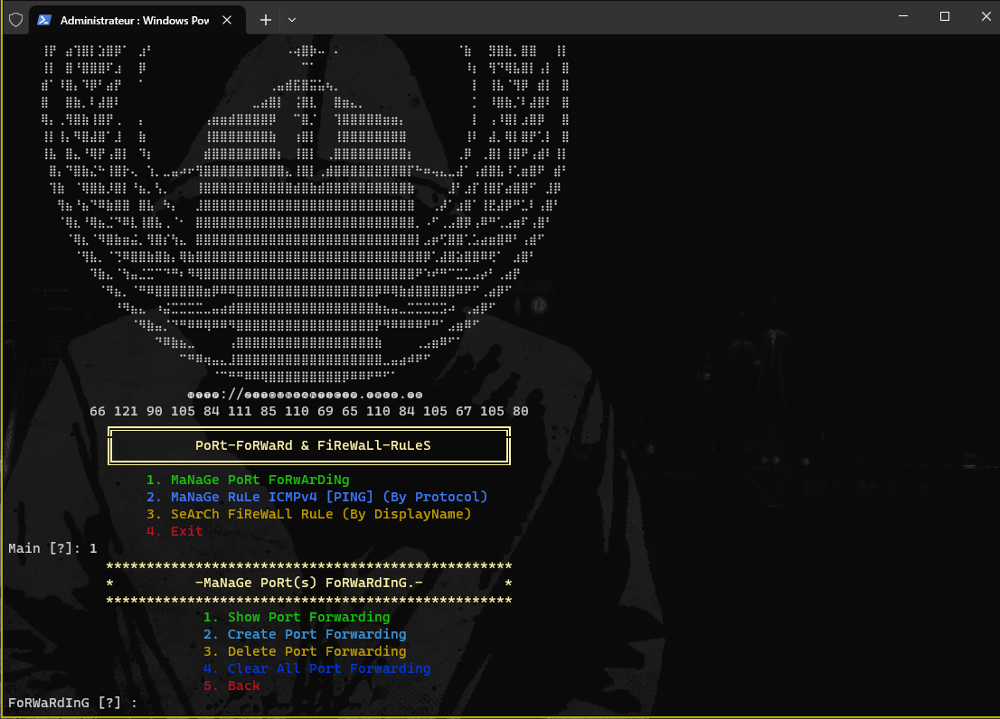
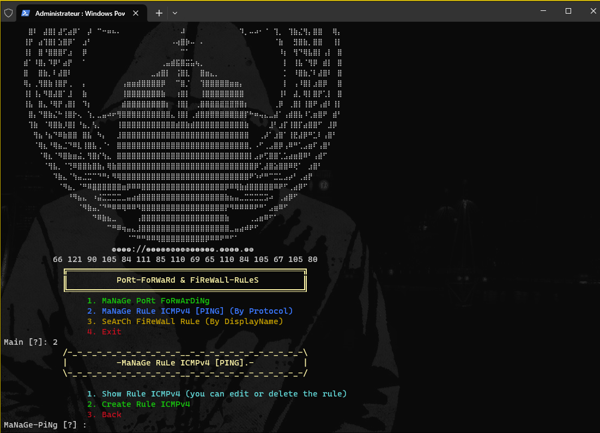

# Manage Port Forwading & Firewall Rule ICMPv4

## Script PowerShell for Manage Port Forwading & Firewall Rule ICMPv4 

### Script PowerShell pour ajouter et supprimer des redirection(s) de port(s), également pouvoir créer et éditer et supprimer des règles par feu Windows pour principalement le Protocol ICMPv4 et j'inclus aussi une option pour rechercher des règles par feu par leur "DisplayName" soit par exactitude soit de façon plus générique avec *. 

### PowerShell script designed to add and remove port redirections, create, edit, and delete Windows Firewall rules primarily for the ICMPv4 Protocol. Additionally, it includes an option to search firewall rules by their 'DisplayName,' allowing for precise or more generic matching using '*.

#### powershell -ExecutionPolicy Bypass -File .\main.ps1

https://www.youtube.com/watch?v=Zc2aQRsQLlE&t

